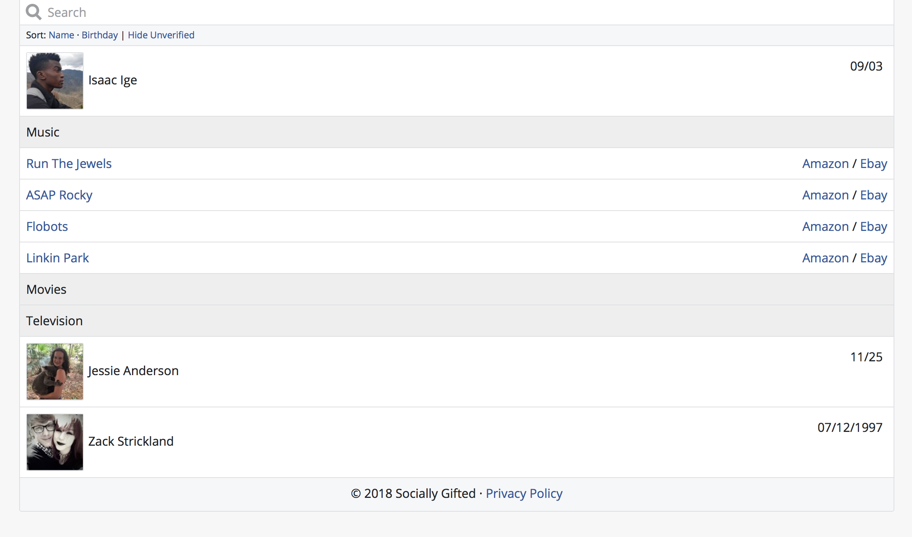
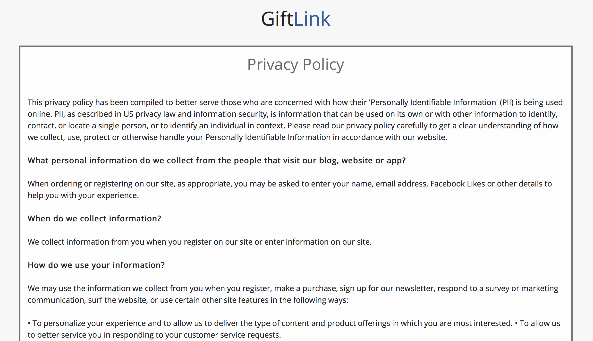

  **Program Name**: GiftLink 
  
  **Team Name**: Socially Gifted
  
  **Team Number**: 4
  
  **Members**:  
    
  Frankie Betancourt  
  Isaac Ige  
  Landen McDonald  
  Zack Strickland  

  
  ## Introduction
**GiftLink** is a gift-planning web application that utilizes the Facebook Graph API in order to help our users find the ideal gifts for their friends and family. **GiftLink** uses an individual's liked Facebook pages to compile and categorize a list of that person's interests. It then dynamically generates links to Amazon and Ebay with the corresponding page's title as a search parameter. 

We were motivated to create this application in order to combat our own struggles with finding the perfect gifts for our friends and family. A few of us have always been notorious for simply giving gift cards and cash, and we believed it was time to make a change. Over the course of this semester, the Socially Gifted team has been able to implement a minimum viable system of our **GiftLink** web application. Ultimately, we believe we were able to create a feature-rich and user-friendly environment for our users that accomplished nearly every goal that we set for ourselves at the beginning of the semester.
  
  ### Major Features and Accomplishments:
  
  - Allowing users to log into our webapp through Facebook
  - Simple user interface to enhance the aesthetics of our application
  - Utilizing Bootstrap to make **GiftLink's** UI resposive and mobile-friendly
  - Accessing a user's friend list and displaying those that have also authorized **GiftLink**
  - Listing a friend's interests such as music, movies, sports, etc.
  - Created filtering feature that only displays verified interests
  - Sorting feature for both name and birthday (ascending/descending)
  - Dynamically generating and providing links to Amazon and Ebay searches based on the listed interests
  - Listing all friends' upcoming birthdays
  - Added a calendar with upcoming holidays to UI
  - Created test users through the Facebook app dashboard
  - Drafted a privacy policy and began preparing **GiftLink** for official Facebook app review
  - Created a Facebook page for **GiftLink** with a link to the webapp
  - Created unit test suite using Python and Selenium
  
  ### Changes from Original Proposal:
  
  - Switched from developing a desktop application to web application
  - Utilizing Facebook's JavaScript SDK rather than the Python "Requests" module to make the appropriate HTTP requests to the Graph API
  - Implementing UI with Bootstrap front-end web framework rather than PyQt
  - Expanded sprint durations to accomodate additional feature implementations
  
  
  ## Customer Value
  No changes
  
  
  ## Technology
  Initially, we wanted to implement GiftLink as a desktop application using Python. This was the programming language that our team was most familiar with and there were tools available to address each aspect of the software. We thought this path would expedite development and testing since all team members had some familiarity with the tools as well as reduce the amount of interfacing (be able to make a basic GUI with PyQt and make testing easier when we start implementing the machine learning features with Tensorflow).

However, we quickly discovered that the Facebook Graph API is not very well-suited for the desktop environment and that it would be easier to begin building this software as a web application for these reasons:

 - Inconsistencies in how pywebview was behaving on different operating systems. 
 
 - There are many security practices that Facebook puts into place that proved to be cumbersome from a developer standpoint such as:
	- Preventing cross-site request forgery by having restrictions on the origins of a request to the API
	
	- Extremely limited time to grab the user's access token from the response and pywebview was not fit for the task

Instead of continuing to try and build **GiftLink** with Python, we realized that Facebook's JavaScript SDK is much more developer-friendly and greatly simplifies access to the various nodes and endpoints containing relevant user information. Upon officially adopting this new framework for **GiftLink**, we have been able to rapidly iterate through the implementation of numerous features for our product.

We also realized that we were thinking about machine learning/recommendation systems too soon. Discovering how we wanted to identify and list interests was challenging in and of itself. Incorporating machine learning into this web application would require us to already have established a thorough and robust gift-idea generation system. While this feature would be valuable to our users, it is not essential for the core functionality of the software. As a result, we decided to postpone that aspect of the project.

With a combination of various web development libraries and frameworks* we have created a simple user interface for our HTML webpage that intuitively allows users to find the interests of their friends and search for products relating to those interests on Amazon and Ebay.

***Libraries & Frameworks:**
-   Bootstrap (ver. 4.0)  
-   Bootbox (ver. 4.4.0) 
-   jQuery (ver. 3.3.1)
-   Animate.css (ver. 3.5.2)    
-   Zabuto Calendar    
-   Google Fonts
-   Selenium webdriver (ver. 3.11.0)

Below are a few screenshots displaying the improvements that we have made to **GiftLink** since our status report:

**Figure 1.** This is our login screen where users will connect to Facebook.

**Figure 2.** Zabuto Calendar populated by Google's "Holidays in the U.S."

**Figure 3.** This is our main user interface that shows birthdays, interests, links to Amazon and Ebay, etc. 
It also shows the sorting functionality for names and birthdays as well as **GiftLink's** verication filter.

**Figure 4.** This is an example of our search bar dynamically filtering friends based on the search string.

**Figure 5.** This is our dedicated page for our privacy policy.

  ### Testing
  Utilizing the python unittest framework as well as Selenium webdriver, we were able to implement a number of tests for **GiftLink**. We also made use of creating test users directly from Facebook's application dashboard in order to effectively run our tests for multiple users and testing scenarios. These tests helped us ensure that this application continued to function as intended throughout the development process. Testing the core features and components of **GiftLink** at every step of the project allowed us to catch hidden bugs in the software and maintain the integrity of our application. The following tests were developed for this project:
  
  - **Login** - ensures that the application can properly login via Facebook and logout accordingly
  - **Friends List** - tests that all of a user's friends that have granted access to our application are listed
  - **Interests** - checks that user interests and likes are properly displayed when clicking on a user from the friends list
  - **Search** - maintains that the search bar functions correctly and only the corresponding users are displayed
  - **Calendar** - ensures that calendar features operate as intended and proper date is displayed

  ### Future Goals:
Now that Socially Gifted has been able to create a functional version of the **GiftLink** software, we are ready to move forward with implementing additional functionality and making this program a more feature-rich experience for its users. The team has agreed to focus its efforts on the following objectives as we move forward in the future with the development of this application:
  
 - Implement a wishlist feature for users to specify gifts that they would want themselves
 - Add simple reminders feature for upcoming gift-giving holidays
 - Submit application for app review in order to gain full access to permissions for non-developers
 - Find/Develop a machine learning algorithm/recommendation system that we can use to intelligently suggest specific products based on user interests
 - Expand the online marketplace search beyond Amazon and Ebay
 - Curate and reduce the list of suggested gifts to make the process more focused/seamless  
  
  
  ## Team
  The Socially Gifted team was able to effectively distribute the workload of this project amongst team members in order to accomplish the goals that we set for ourselves throughout the duration of the semester. The roles of each member remained mostly static throughout the project and can be seen below.
  
  **Frankie Betancourt**: Developer  
  Responsibilities / Contributions:
 - API Implementation and Testing
 - Documentation
 - Code validation and debugging
 - Sprint task evaluation
  
  **Isaac Ige**: Developer  
  Responsibilities / Contributions:
 - Guide the direction of development
 - API Implementation and Testing
 - Research available resources/libraries that may aid development
 - Code maintenance

  **Landen McDonald**: Task Supervisor / Quality Assurance  
  Responsibilities / Contributions:
 - Organize group meetings, generate team objectives, and devise feature suggestions
 - Draft basic documentation such as privacy policy, README, and general api information 
 - Develop Facebook page for application
 - Create test users, define their attributes, and link them as friends
 - Develop system unit test suite using Selenium and Python's unittest framework
  
  **Zack Strickland**: Developer  
  Responsibilities / Contributions:
  - Implement and test API features
  - Design graphical user interface to meet Facebook guidelines
  - Ensure high quality user experience
  - Code maintenance
  
  
  ## Project Management
  The development of our project remained mostly on schedule as described in our project proposal throughout the semester. Initially, we would have liked to have submitted the application for review by now, but the scandal that has surrounded Facebook throughout the last few months has delayed this endeavor. The implementation of machine learning algorithms for gift suggestion generation have also been put on hold for the time being as we realized that we may have overstepped ourselves with this objective. In order to properly train a model, we will need to have an immense amount of data, which will be better suited for development once we have garned a significant user base.
  Although we were running slightly behind schedule at the end of Sprint 2 due to the pywebview inconsistencies, the additional week that was built into Sprint 3 for Spring Break allowed the team to more than make up for the lost time. Since Sprint 3, development rapidly accelerated as we were able to implement key functionality that vastly improved the user experience of **GiftLink**. Overall, the development of the **GiftLink** software has proven to progress well and we believe that it is fully prepared for future development.
  
  
  ## Reflection
  Socially Gifted had a slow start with the implementation of **GiftLink** due to the unforseen complications that arose with the development of the intended desktop framework. However, once we pivoted to the current web application design, productivity rapidly accelerated as we were able to quickly construct a functional application. Utilizing this updated framework for project development, the team is confident that **GiftLink** will continue to evolve into an innovative  platform that offers our users unparalleled convenience and functionality.
  Most importantly, the Socially Gifted team proved to be able to effectively collaborate and resolve conflicts and issues in our software in order to develop a functional application. Our greatest attribute as a team was our ability to divide work evenly across the team in order to rapidly fix bugs and implement new features. Coupling this with the team's creative vision for improving the user experience and developing additional functionality for **GiftLink** allowed the team to efficiently iterate through the software development process. We have defined a strong direction for our software moving forward and plan to eventually pass application review so we can make **GiftLink** accessible to all.
  Ultimately, the entire Socially Gifted team can agree that we are extremely pleased with the way **GiftLink** turned out. This application has nearly all of the functionality that we inteded for it, and it will only improve from here. The strong foundation that we have laid for this application throughout this semester lends itself nicely to future development and will prove to be a great stepping stone toward our ultimate goals for this project.
